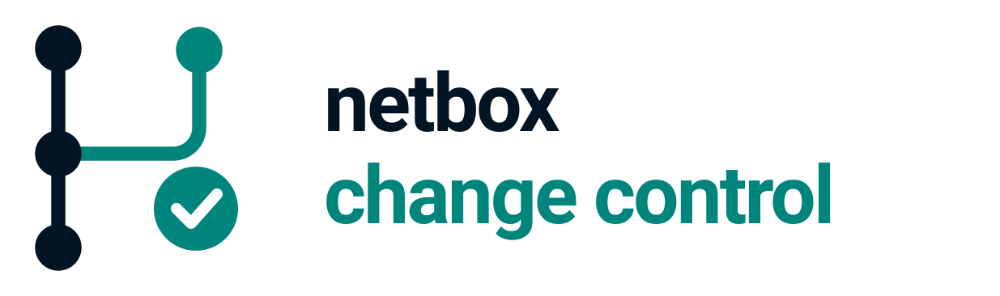

<div align="center">
  
  <p><strong>Policy-driven change control and mandatory review for NetBox branches</strong></p>
  <p>change requests &bull; policies &bull; checks &bull; comments</p>
  
  
  
  
  <p>
    <strong><a href="https://antoinekh.github.io/netbox-change-control/">Documentation</a></strong> |
    <strong><a href="https://antoinekh.github.io/netbox-change-control/installation/">Install</a></strong> |
    <strong><a href="https://antoinekh.github.io/netbox-change-control/policies/">Policies</a></strong> |
    <strong><a href="https://antoinekh.github.io/netbox-change-control/checks/">Checks</a></strong> |
    <strong><a href="https://antoinekh.github.io/netbox-change-control/changelog/">Changelog</a></strong>
  </p>
</div>

This plugin builds on [netbox-branching](https://github.com/netboxlabs/netbox-branching). A branch stages your changes; this plugin decides who must approve them and refuses the merge until they have.

The goal is change control that is **policy driven**: who must approve a change is decided by the objects it touches, not by whoever opened it. Around that sit two extension points, so the same gate can be driven by more than people. Pre-merge **checks** are pluggable, and an event fires on every status change, so a change request can call an external system, wait for a CI result, or ask a model to review the diff before anyone merges it. See [writing your own checks](https://antoinekh.github.io/netbox-change-control/custom-checks/), which includes an AI reviewer and a CI reporter.

It takes ideas from **[NetBox Labs change management](https://netboxlabs.com/docs/changes/)**, for policies and rules governing who must review a branch; from **GitHub**, for status checks that gate a merge independently of human approval and for review comments anchored to a specific change; and from **[Infrahub](https://docs.infrahub.app/topics/proposed-change)** by OpsMill, for treating a proposed change as a first-class object that carries its own validation.

> [!NOTE]
> **Independent community plugin.** Free, MIT licensed, not official, not certified and not endorsed by NetBox Labs. It bundles no netbox-branching code. You install that package yourself, and its own licence governs how you may use it.
>
> No commercial support. If you need a supported product, use the [NetBox Labs](https://netboxlabs.com/docs/changes/) change management plugin.

> [!WARNING]
> **Not stable yet.** The version is below 1.0. Models, settings and the REST API can still change between releases. Read the [changelog](CHANGELOG.md) before you upgrade.

<p align="center">
  <a href="#how-it-works">How it works</a> |
  <a href="#documentation">Documentation</a> |
  <a href="#features">Features</a> |
  <a href="#requirements">Requirements</a> |
  <a href="#quick-install">Quick install</a>
</p>

<p align="center">
  
</p>

## How it works

1. Someone creates a branch and makes their changes inside it, as normal for netbox-branching.
2. They open a **change request** against that branch.
3. The plugin reads which object types the branch touches and attaches every **policy** whose scope matches. A policy can narrow further on the values of the objects themselves. The author cannot remove them.
4. Each policy contains **rules**. A rule says how many approvals it needs and who may give them.
5. Reviewers **approve**, request changes, or comment. They can also comment on one specific changed object.
6. Independently, the **pre-merge checks** named by those policies run. A required check that is not passing blocks the merge on its own.
7. Once every rule is satisfied and every required check passes, the **merge** button appears.
8. After the merge, the request is marked completed.

Two gates guard the merge and they are independent: the people gate (policies and reviews) and the machine gate (checks). A change can be approved by every reviewer and still be refused by a check.

## Documentation

The documentation is a website: **[antoinekh.github.io/netbox-change-control](https://antoinekh.github.io/netbox-change-control/)**. Its sources are the Markdown files in [`docs/`](docs/), built with [Zensical](https://zensical.org/) and published by GitHub Actions on every push to `master`.

| Page | Covers |
|---|---|
| [Installation and configuration](https://antoinekh.github.io/netbox-change-control/installation/) | Requirements, installing, and every setting. |
| [Policies and rules](https://antoinekh.github.io/netbox-change-control/policies/) | Scoping a policy and writing rules. |
| [Policy conditions](https://antoinekh.github.io/netbox-change-control/policy-conditions/) | Narrowing a policy on object values. |
| [Conflicts with main](https://antoinekh.github.io/netbox-change-control/conflicts/) | What counts as a real conflict, and how to resolve one. |
| [Change requests](https://antoinekh.github.io/netbox-change-control/change-requests/) | The lifecycle, and what survives a branch deletion. |
| [Reviews](https://antoinekh.github.io/netbox-change-control/reviews/) | Submitting reviews and commenting on individual changes. |
| [Pre-merge checks](https://antoinekh.github.io/netbox-change-control/checks/) | What checks are and which ship built in. |
| [Writing your own checks](https://antoinekh.github.io/netbox-change-control/custom-checks/) | The registry, an AI reviewer, and reporting from CI. |
| [Event rules](https://antoinekh.github.io/netbox-change-control/event-rules/) | Firing a webhook or a script on a change request. |
| [Merging, windows and auto-merge](https://antoinekh.github.io/netbox-change-control/merging/) | Change windows and automatic merging. |
| [Protecting main](https://antoinekh.github.io/netbox-change-control/protect-main/) | Requiring a branch, optionally for part of NetBox only. |
| [Automatic behaviours](https://antoinekh.github.io/netbox-change-control/automation/) | Stale reviews, reevaluation, notifications. |
| [Administration guide](https://antoinekh.github.io/netbox-change-control/admin-guide/) | Roles, the permission matrix, building policies, troubleshooting. |
| [Permissions](https://antoinekh.github.io/netbox-change-control/permissions/) | The short reference for every permission name. |
| [REST API](https://antoinekh.github.io/netbox-change-control/api/) | Every endpoint. |
| [Extending this plugin](https://antoinekh.github.io/netbox-change-control/extending/) | How another plugin adds content and checks. |
| [Design](https://antoinekh.github.io/netbox-change-control/design/) | Why it is built this way. |

To read the site on your own machine, install [Zensical](https://zensical.org/) and run `zensical serve` at the root of a checkout.

## Features

| Feature | Status |
|---|---|
| Policies containing rules with a minimum approval count | Done |
| Rules naming reviewer groups and individual reviewers | Done |
| Policies attached automatically, scope-matched from the branch contents, following it as it changes, and not selectable by the author | Done |
| Policy conditions, narrowing a policy on the values of the changed objects | Done |
| Change requests with status and priority | Done |
| Reviews with approve, request changes, and comment | Done |
| Per-change comments on the branch diff, with threaded replies, in Markdown | Done |
| Merge button appears once approved | Done, on the change request and on the branch |
| Status set to **completed** after a successful merge | Done |
| Pre-merge gate, enforced regardless of `protect_main` | Done |
| `protect_main` blocks direct edits outside a branch, optionally scoped | Done, with a bypass permission |
| Stale review detection when the branch changes | Done |
| Approval invalidation when the branch changes after approval | Done |
| Policy reevaluation on rule, reviewer or group membership change | Done |
| Real conflicts with main, distinguished from a stale branching baseline | Done |
| Notifications to reviewers | Done, through NetBox's notification inbox |
| Pluggable pre-merge checks, in-process or reported over the REST API | Done |
| Change windows, with an override permission | Done |
| Automatic merge once every gate is satisfied | Done |
| Change request survives deletion of its branch | Done |
| REST API for every model | Done |

## Requirements

| Component | Version |
|---|---|
| NetBox | `>= 4.6.9, < 4.7` |
| netbox-branching | `>= 1.1.3, < 1.2` |
| Python | `>= 3.12` |

## Quick install

```python
# configuration/plugins.py
PLUGINS = [
    'netbox_change_control',
    'netbox_branching',          # must stay last
]

PLUGINS_CONFIG = {
    'netbox_branching': {
        'exempt_models': ['netbox_change_control.*'],   # required
    },
}
```

```bash
./manage.py migrate netbox_change_control
```

See [Installation and configuration](https://antoinekh.github.io/netbox-change-control/installation/) for the detail, including why `exempt_models` is not optional.
