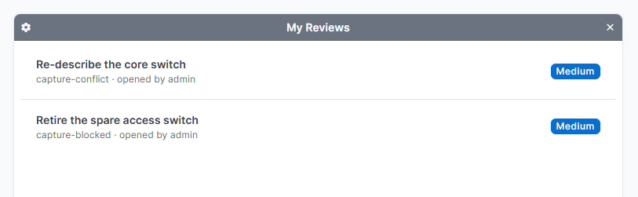

# Automatic behaviours and notifications

- **Stale reviews.** Each review records the timestamp of the newest change in its branch at the moment it was submitted. A review is stale when the branch has moved on since. Stale approvals and stale rejections are excluded from the evaluation, so an approval can never cover work the reviewer did not see. Stale reviews carry a badge.
- **Approval invalidation.** This falls out of staleness. When a branch is synced, reverted, or edited, its existing approvals go stale, the rules stop being satisfied, and the status returns to Needs review on its own.
- **Policy reevaluation.** Signal receivers watch policies, rules, the rule's group and user lists, and user group membership. Any change re-evaluates every open change request bound to the affected policy. Raising a rule's minimum, or removing a reviewer from a group, revokes an approval that depended on it.
- **Completion on merge.** A `post_merge` receiver sets the status to completed. Terminal statuses are never reopened.
- **Check refresh.** Checks re-run when the branch content moves and when a comment thread is opened, resolved or removed.

## Notifications

Notifications use NetBox's own inbox and appear in the bell menu. They fire on a status transition only, never on every save.

| Transition | Who is told |
|---|---|
| To Needs review | The reviewers of rules that are still short. Rules colleagues have already satisfied are skipped, and the requester is always excluded. |
| To Approved | The requester, who merges next. |
| To Rejected | The requester. |

Six lifecycle event types are emitted, so a NetBox event rule can fire a webhook or run a script on any of them. They are separate from the notifications above: an event rule reaches other systems, a notification reaches a person. See [event rules](event-rules.md).

Set `notify_reviewers` to `False` to turn the notifications off. The events are emitted either way, so an integration keeps working on a site that does not use the inbox.

## Dashboard widget

**My Reviews** lists the change requests waiting on the signed-in user. Add it from the NetBox dashboard.

It uses the same logic as the notifications, so the widget and the inbox agree: a request appears only when a rule the user is eligible for is still short and they have not already reviewed it.
