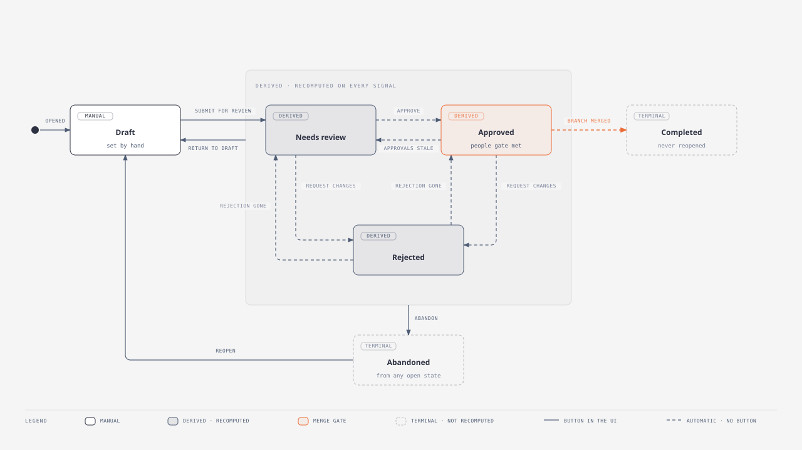

# Change requests

One change request per branch.

| Field | Meaning |
|---|---|
| Branch | The branch this request proposes to merge. |
| Reference | An external reference: a ticket id, a change number, whatever your process uses. Optional, shown in the list, searchable and filterable. |
| Title | A short summary. |
| Description | A longer explanation of what is changing and why. Shown in the list and on the detail page. |
| Status | Draft, Needs review, Approved, Rejected, Completed or Abandoned. |
| Priority | Low, Medium, High or Critical. |
| Requester | Who opened it. |
| Window opens / closes | An optional [change window](merging.md#change-windows). |
| Merge automatically | Merge without further human action once every gate passes. See [automatic merging](merging.md#automatic-merging). |

Status is derived from the policy evaluation and is refreshed automatically, so it is not a field you set. It is read-only on the REST API and absent from the bulk edit form, because Completed is terminal: the merge gate refuses a completed request and nothing reopens one, so setting it by hand blocked its branch from merging for good.

The two transitions a person makes by hand have an action each, and a permission each.

| Action | Where | Permission | Allowed from |
|---|---|---|---|
| **Abandon** | The change request page, or `POST /change-requests/{id}/abandon/` | `netbox_change_control.abandon_changerequest` | Draft, Needs review, Approved, Rejected |
| **Reopen** | The change request page, or `POST /change-requests/{id}/reopen/` | `netbox_change_control.reopen_changerequest` | Abandoned only |

Reopening returns the request to Draft and then recomputes, rather than restoring the status it held before. Its reviews may have gone stale and its policies may have changed while it was set aside, so the honest answer has to be worked out again.

Completed is never reopened. It records a merge that actually happened, and taking it back up would invite a second merge of a branch already in main.

## The lifecycle

A solid arrow is a button in the plugin. A dashed arrow is the plugin moving the request on its own, when it recomputes the policy evaluation.

### Every transition

| From | To | How it happens | Who or what does it | Permission |
|---|---|---|---|---|
| *(none)* | Draft | A change request is opened against a branch | Manual | `add_changerequest` |
| Draft | Needs review | **Submit for review**, which also matches the policies | Manual | `change_changerequest` |
| Needs review | Approved | Every rule of every attached policy has its approvals, and nobody has requested changes | Automatic, once the **required human action** of approving has happened | `add_review` to approve |
| Needs review | Rejected | A reviewer requests changes | Automatic, on the **required human action** | `add_review` |
| Approved | Needs review | The branch moved, so the approvals went stale; or a policy, rule or group membership changed | Automatic | none |
| Approved | Rejected | A reviewer requests changes after approval | Automatic | `add_review` |
| Rejected | Needs review | The rejection was withdrawn, or the branch moved and it went stale | Automatic | none |
| Rejected | Approved | The rejection cleared and the rules are satisfied | Automatic | none |
| Needs review, Approved, Rejected | Draft | **Return to draft**, to take the change back off the table | Manual | `change_changerequest` |
| Approved | Completed | The branch merged | Automatic, on the merge | `merge_branch` to merge |
| Any open state | Abandoned | **Abandon** | Manual | `abandon_changerequest` |
| Abandoned | Draft | **Reopen** | Manual | `reopen_changerequest` |

### What the states mean

**Draft** is the author's. The plugin does not move a request out of it, and a review submitted against a draft changes nothing. This is what makes **Return to draft** worth having: a request pulled back stays pulled back while the author works, instead of being pushed straight back into review by the next signal.

**Needs review**, **Approved** and **Rejected** are derived. They are a cached view of the policy evaluation, recomputed whenever anything that could change the answer happens, which is why they are not editable and why the arrows between them carry no permission: nobody sets them, they follow from the reviews.

**Completed** and **Abandoned** are terminal. Completed records a merge that happened and is never reopened, because the branch is already in main. Abandoned can be reopened, which returns the request to Draft rather than to whatever it held before: its reviews may have gone stale and its policies may have changed while it was set aside, so the author submits it again and the evaluation works out the honest answer.

!!! note

    Only **Approved** opens the merge gate, and even then the checks and the change window are separate gates on top of it. See [approved is not the same as mergeable](#approved-is-not-the-same-as-mergeable).

## Approved is not the same as mergeable

**Approved** means the people gate is satisfied: every policy rule has its approvals. It does not mean the change can go ahead. Checks and the change window are separate gates, so a request can be approved and still blocked, for example by an unresolved comment thread.

The change request page shows both. The status badge reads `Approved`, and beside it a `Blocked` badge appears with the reason whenever the change cannot actually merge:

> **Approved** · **Blocked**
> Approved by reviewers, but not yet mergeable. Required checks are not passing: Comment threads resolved (failed).

The REST API exposes `ready_to_merge` and `merge_blocked_reason` alongside `approved`, and this page's own badge reads the same source. All of them delegate to netbox-branching, so they account for every gate, including validators registered by other plugins.

The change request **list** answers the same question from a cache, because computing it per row cost about eleven queries and a page holds fifty. The cache is refreshed whenever anything that could change the answer happens: a review, a policy, a check, a branch sync, a new change in the branch. The change window is the exception, since a window opens because the clock moved rather than because anything happened, so it is evaluated as the row is rendered from fields already loaded.

Two consequences worth knowing. The list does not account for merge validators registered by other plugins, which this page does. And the list is what you sort and filter on, which the live version could never support. Where the two could disagree, this page is authoritative, and the merge gate itself never reads the cache at all.

## Finding a change request

Change requests appear in NetBox's global search, and the **reference** is weighted above everything else, so typing a ticket number finds the change it spawned. The title, description, comments and the branch name are searched too.

The branch **name** is what is indexed, not the branch itself, so a change request whose branch has been deleted is still found by the name that branch had. That is the case where search is the only way left to reach it.

Policies, rules, reviews, pre-merge checks and the per-object comments are all searchable as well. A comment keeps the name of the object it was about, so searching for a device finds the discussion about it long after the branch is gone.

!!! note

    Search reads an index NetBox maintains as objects are written. Objects that already existed when this plugin was upgraded are indexed by running `./manage.py reindex netbox_change_control` once.

## The record outlives the branch

A change request is the record of who approved what, so it survives deletion of its branch. The branch link is cleared, the branch **name** is kept and follows the branch through any rename, and the title, description, reviews, comment threads, applied policies and check results all remain. Each comment also keeps the name of the object it was about, so the discussion still makes sense once the diff is gone.

Such a request shows its branch name with a **Deleted** badge and is a historical record only: it cannot be merged, its diff is gone, and its checks report as skipped rather than failing. The REST API exposes `branch_name` and `branch_deleted` alongside `branch`.
