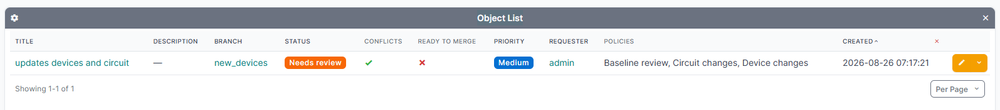

# Change requests

One change request per branch.

| Field | Meaning |
|---|---|
| Branch | The branch this request proposes to merge. |
| Title | A short summary. |
| Description | A longer explanation of what is changing and why. Shown in the list and on the detail page. |
| Status | Draft, Needs review, Approved, Rejected, Completed or Abandoned. |
| Priority | Low, Medium, High or Critical. |
| Requester | Who opened it. |
| Window opens / closes | An optional [change window](merging.md#change-windows). |
| Merge automatically | Merge without further human action once every gate passes. See [automatic merging](merging.md#automatic-merging). |

Status is derived from the policy evaluation and is refreshed automatically. Completed and Abandoned are terminal and are never reopened.

## Approved is not the same as mergeable

**Approved** means the people gate is satisfied: every policy rule has its approvals. It does not mean the change can go ahead. Checks and the change window are separate gates, so a request can be approved and still blocked, for example by an unresolved comment thread.

The change request page shows both. The status badge reads `Approved`, and beside it a `Blocked` badge appears with the reason whenever the change cannot actually merge:

> **Approved** · **Blocked**
> Approved by reviewers, but not yet mergeable. Required checks are not passing: Comment threads resolved (failed).

The change request list carries a **Ready to merge** column, and the REST API exposes `ready_to_merge` and `merge_blocked_reason` alongside `approved`. All of them delegate to netbox-branching, so they account for every gate, including validators registered by other plugins.

## The record outlives the branch

A change request is the record of who approved what, so it survives deletion of its branch. The branch link is cleared, the branch **name** is kept, and the title, description, reviews, comment threads, applied policies and check results all remain. Each comment also keeps the name of the object it was about, so the discussion still makes sense once the diff is gone.

Such a request shows its branch name with a **Deleted** badge and is a historical record only: it cannot be merged, its diff is gone, and its checks report as skipped rather than failing. The REST API exposes `branch_name` and `branch_deleted` alongside `branch`.
