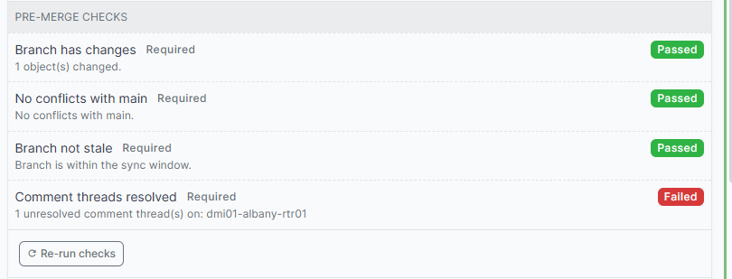

# Pre-merge checks

A check is a named pass or fail result attached to a change request, in the spirit of commit status checks on a hosted git service.



A **required** check that is not passing blocks the merge on its own, regardless of the reviews.

| Status | Clears the gate | Meaning |
|---|---|---|
| `success` | Yes | The check passed. |
| `skipped` | Yes | The check did not apply to this change. |
| `pending` | No | Declared but never reported. |
| `running` | No | In progress. |
| `failure` | No | The check found a problem. |
| `error` | No | The check itself broke. |

A check marked `required = False` is advisory. It shows its result and never blocks.

Whether a check is required comes from the registry, the plugin configuration and the policies, never from the stored row. Deleting a check's row, or flipping `required` on it through the API, does not open the gate: a required check with no result is treated as **not run**, and blocks. This matters because the token your CI uses to report results would otherwise be able to neutralise the gate it reports to.

Checks appear on the change request page with a **Re-run checks** button, and in a list under **Change Control > Merge Checks**.

### When checks run

A result reflects the last run, so knowing when that happens matters:

| Moment | Why |
|---|---|
| The change request is created | So a new request never shows checks stuck on `pending`. |
| It is submitted for review | The reviewer needs a current answer. |
| It reaches **Approved** | This is the moment a merge becomes possible, so the results must be current. A branch edit invalidates the reviews but not the stored check results; without this refresh a request could be edited to introduce a conflict, re-approved, and merged against a stale `no-conflicts` result. |
| A policy attaches or detaches | Which checks apply follows the policies, so the set can change without the branch changing. |
| The branch is synced or reverted | Its content changed. |
| A branch diff changes | A conflict can appear with no event on the change request at all, because somebody edited the same object in main. |
| A comment thread is opened, resolved or removed | `threads-resolved` reads them. |
| Somebody presses **Re-run checks** | On demand. |

Externally reported checks are never overwritten by a run: only the system that reports them knows the answer.

Several of those moments arrive together. Attaching policies is one event per policy, so submitting a request would otherwise run every check once per policy for the same answer; the run is collapsed to one per change request instead. It still happens before the page you submitted from comes back, so a result is never a refresh behind.

A result that moves is recorded in the object's changelog, so the machine half of a merge decision is auditable alongside the human half. A re-run that finds the same answer writes nothing, which keeps the log to real transitions; `completed` therefore marks when the result last changed, not when a check last ran.

## Built-in checks

Four ship, available to any policy. Together they catch the merges that damage data rather than merely lack approval. None of them applies until a policy names it.

| Name | Label | Fails when |
|---|---|---|
| `has-changes` | Branch has changes | The branch contains nothing to merge. |
| `no-conflicts` | No conflicts with main | Branching flags a conflict with main, so merging would silently discard someone else's work. |
| `not-stale` | Branch not stale | The branch is too far behind main to be synced safely. |
| `threads-resolved` | Comment threads resolved | A comment thread on the Changes tab is still open. |

### Choosing which built-ins to use

`enable_builtin_checks` decides which built-ins are **available**:

```python
'enable_builtin_checks': True,     # all four (default)
'enable_builtin_checks': False,    # none
'enable_builtin_checks': [         # only these
    'no-conflicts',
    'threads-resolved',
],
```

Availability is not application. A registered check does nothing until a **policy names it**, so where each one applies is decided in policies rather than in configuration. There is one mechanism instead of two that can disagree.

An unrecognised name is logged and skipped, so a typo cannot stop NetBox from booting.

### Applying a check everywhere

Create a policy with **no object types**, which matches every branch, and name the checks on it:

| Field | Value |
|---|---|
| Object types | *(empty)* |
| Registered checks | `has-changes`, `no-conflicts`, `not-stale` |

!!! info "Important"

    A change request is not satisfied while no rule applies to it, so a checks-only policy which is the only one matching a branch leaves the request unable to be approved. The approval panel says "No policy rules apply to this change request" when this happens.

## Which checks apply, and where

Every check, built-in or your own, is opted into by a policy. That scopes a check by **what the change touches**, without writing that logic into the check itself: a peer sign-off that only matters for circuits never appears on an IPAM change, so nobody learns to skip checks by reflex.

Register your own with the `policy` scope, which is what the built-ins use:

```python
from netbox_change_control.checks import CheckResult, CheckScope, register_check


def peer_signoff(change_request):
    ...


register_check('peer-signoff', 'Peer sign-off', peer_signoff, scope=CheckScope.POLICY)
```

Then name it on the policies which need it. The policy form has two fields under **Checks**:

| Field | Holds |
|---|---|
| **Registered checks** | A list of every opt-in check the running NetBox knows about, built from the registry. Pick from it. |
| **Reported checks** | Names of checks reported from outside NetBox, comma separated. Nothing declares these first, so they cannot be offered in a list. |

Both are stored in one list on the policy, which is what the API exposes:

```bash
curl -X PATCH "$NETBOX/api/plugins/change-control/policies/$POLICY_ID/" \
  -H "Authorization: Token $TOKEN" -H "Content-Type: application/json" \
  -d '{"checks": ["peer-signoff"]}'
```

`checks` replaces the whole list, so send every name the policy should require, not just the new one. Read it back first if you are adding to an existing set:

```bash
curl -s -H "Authorization: Token $TOKEN" \
  "$NETBOX/api/plugins/change-control/policies/$POLICY_ID/" | jq '.checks'
```

The check now runs only on change requests carrying that policy. Elsewhere it has no row, does not run, and does not block. Detach the policy and its check disappears with it.

To see which policies bring a check in, filter the policy list on **Required checks**, or query `?required_checks=no-conflicts`. Several names are an OR: it answers "which policies require any of these".

### Requiring an external result from a policy

A name in a policy's **Checks** which is not a registered check is treated as one reported from outside, exactly like an entry in `required_external_checks`. It is created as `pending` and blocks the merge until something reports a result.

The name is yours to choose. Nothing declares it beforehand and no check by that name ships with the plugin: writing it on the policy is what brings it into being. Pick something your pipeline can recognise.

Type it into **Reported checks** on the policy form, or send it through the API:

```bash
curl -X PATCH "$NETBOX/api/plugins/change-control/policies/$POLICY_ID/" \
  -H "Authorization: Token $TOKEN" -H "Content-Type: application/json" \
  -d '{"checks": ["cab-approval"]}'
```

Every change request carrying that policy now shows a required `cab-approval` check, pending, blocking the merge. Whatever performs the sign-off reports the result the same way any external check does:

```bash
CHECK_ID=$(curl -s -H "Authorization: Token $TOKEN" \
  "$NETBOX/api/plugins/change-control/checks/?change_request_id=$CR_ID&name=cab-approval" \
  | jq -r '.results[0].id')

curl -X PATCH "$NETBOX/api/plugins/change-control/checks/$CHECK_ID/" \
  -H "Authorization: Token $TOKEN" -H "Content-Type: application/json" \
  -d '{"status": "success", "summary": "Approved at the 14:00 CAB", "details_url": "https://cab.example.com/2026-08-26"}'
```

This is how to require a pipeline, a ticket, or a person outside NetBox for one class of change only, without wiring that requirement into every change request. See [checks reported by an external system](custom-checks.md#checks-reported-by-an-external-system) for the full contract, including why a reporter cannot decide whether its own check counts.

### Scoping on the change request itself

Policies match on the objects a branch touches, not on the change request's own fields. To vary a check by something on the request, such as its change window, read it inside the check and skip when it does not apply:

```python
def out_of_hours_signoff(change_request):
    start = change_request.scheduled_start
    if start is None or 6 <= start.hour < 20:
        return CheckResult.skipped('Not an out-of-hours change.')
    return CheckResult.failed('An out-of-hours change needs the duty manager to sign off.')
```

A skipped check clears the gate, so this blocks only the changes it is about. The cost is a visible row on every request carrying the policy, whatever the answer. Use both together: the policy narrows the check to the changes it could apply to, and the skip handles what a policy cannot express.
