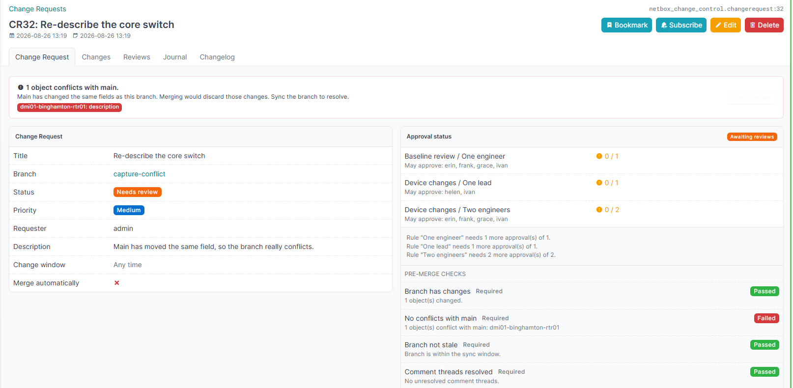

:netbox-change-control-wordmark:{ .ncc-hero__logo }

Policy-driven change control and mandatory review for NetBox branches
{ .ncc-hero__tagline }

change requests &bull; policies &bull; checks &bull; comments
{ .ncc-hero__meta }

This plugin builds on [netbox-branching](https://github.com/netboxlabs/netbox-branching). A branch stages your changes; this plugin decides who must approve them and refuses the merge until they have.

-   :material-clock-fast:{ .lg .middle } **Install it**

    ---

    Two entries in `PLUGINS`, one migration, and every setting explained.

    [:octicons-arrow-right-24: Installation and configuration](installation.md)

-   :material-account-check:{ .lg .middle } **Decide who approves**

    ---

    A policy matches the objects a branch touches and names the reviewers it needs.

    [:octicons-arrow-right-24: Policies and rules](policies.md)

-   :material-shield-check:{ .lg .middle } **Gate the merge**

    ---

    Pre-merge checks block a merge on their own, whoever has approved it.

    [:octicons-arrow-right-24: Pre-merge checks](checks.md)

-   :material-puzzle:{ .lg .middle } **Extend it**

    ---

    Write your own check, or drive a change request from an external system.

    [:octicons-arrow-right-24: Writing your own checks](custom-checks.md)

## How it works

1. Someone creates a branch and makes their changes inside it, as normal for netbox-branching.
2. They open a **change request** against that branch.
3. The plugin reads which object types the branch touches and attaches every **policy** whose scope matches. A policy can narrow further on the values of the objects themselves. The author cannot remove them.
4. Each policy contains **rules**. A rule says how many approvals it needs and who may give them.
5. Reviewers **approve**, request changes, or comment. They can also comment on one specific changed object.
6. Independently, the **pre-merge checks** named by those policies run. A required check that is not passing blocks the merge on its own.
7. Once every rule is satisfied and every required check passes, the **merge** button appears.
8. After the merge, the request is marked completed.

!!! info "Important"

    Two gates guard the merge and they are independent: the people gate (policies and reviews) and the machine gate (checks). A change can be approved by every reviewer and still be refused by a check.

## Where to go next

New here? Read [Installation and configuration](installation.md), then [Policies and rules](policies.md). Everything else can wait until you need it.

| Setting up | Day to day | Gating a merge | Reference |
|---|---|---|---|
| [Installation and configuration](installation.md) | [Policies and rules](policies.md) | [Pre-merge checks](checks.md) | [Automatic behaviours](automation.md) |
| [Administration guide](admin-guide.md) | [Policy conditions](policy-conditions.md) | [Writing your own checks](custom-checks.md) | [REST API](api.md) |
| [Permissions](permissions.md) | [Change requests](change-requests.md) | [Event rules](event-rules.md) | [Extending this plugin](extending.md) |
| | [Reviews](reviews.md) | [Merging, windows and auto-merge](merging.md) | [Design](design.md) |
| | [Conflicts with main](conflicts.md) | [Protecting main](protect-main.md) | [Changelog](changelog.md) |

## Requirements

| Component | Version |
|---|---|
| NetBox | `>= 4.6.9, < 4.7` |
| netbox-branching | `>= 1.1.3, < 1.2` |
| Python | `>= 3.12` |

!!! note

    **Independent community plugin.** Free, MIT licensed, not official, not certified and not endorsed by NetBox Labs. It bundles no netbox-branching code. You install that package yourself, and its own licence governs how you may use it.

    There is no commercial support. If you need a supported product, use the [NetBox Labs](https://netboxlabs.com/docs/changes/) change management plugin.

!!! warning

    **Not stable yet.** The version is below 1.0. Models, settings and the REST API can still change between releases. Read the [changelog](changelog.md) before you upgrade.
