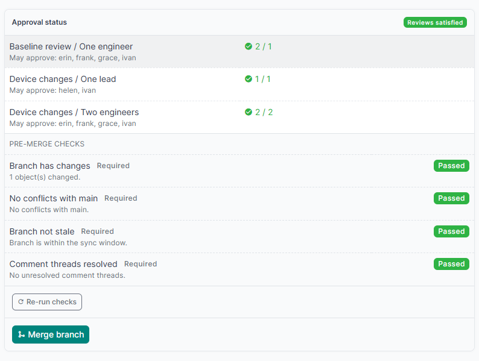
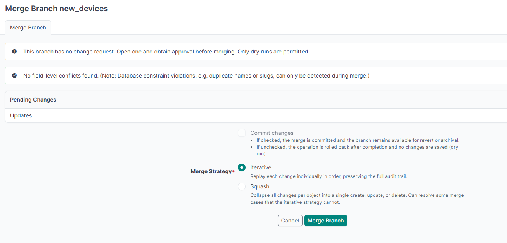

# Merging, windows and auto-merge

Once a change request reaches **Approved** and every required check passes, a **Merge branch** button appears at the bottom of the Approval status panel. It opens the branching plugin's merge form.



The branch page under **Branching > Branches** carries the same information from the other side: the change request governing it, its status, which rules are still short and who may satisfy them, with a link to it. A branch with no change request is told so there, with a button to open one.

While the merge is blocked the button is greyed out and states the reason. If you may approve but not merge, the panel says so rather than hiding the button. The branch page under **Branching > Branches** carries the same button, since the merge itself belongs to the branching plugin.

After a successful merge the change request is marked **Completed**, and it cannot be reopened.

The gate is implemented as a netbox-branching pre-action validator, so a blocked branch also hides its merge button rather than failing after the click. It re-evaluates the policies at merge time instead of trusting the stored status.

### When there is no change request

A branch with no change request cannot merge at all. The branching plugin's own merge form carries the reason, and offers only a dry run:



## Change windows

A change request can carry a window, so an approved change cannot merge at an arbitrary hour.

| Field | Meaning |
|---|---|
| Window opens | Earliest time this change may merge. |
| Window closes | Latest time this change may merge. |

Either bound may be left empty. A start alone means "not before"; an end alone means "not after"; both empty means any time.

The window is a **third, independent gate**, checked alongside the policies and the checks. When it blocks, the merge button states when the window opens or when it closed.

Users holding `netbox_change_control.override_window_changerequest` may merge outside the window, which is what an incident needs. See [granting the exemptions](permissions.md#granting-the-custom-actions).

> [!IMPORTANT]
> The window fails closed when there is no request context. `protect_main` deliberately exempts scripts and background jobs, because those are not interactive edits. A change window is the opposite: a script merging at the wrong hour is exactly what it exists to stop.

## Automatic merging

Tick **Merge automatically** on a change request and it merges itself as soon as every gate is satisfied: the policies are met, every required check passes, and the window is open.

It is triggered two ways, because a request can become mergeable either by something happening or by time passing:

- when the final approval or a passing check arrives, the merge is attempted immediately;
- a system job sweeps periodically to catch a request that was only waiting for its window to open.

So a change approved at midday with a window opening at 21:00 does merge at 21:00, with no further human action. Nothing has to happen at 21:00 except the clock reaching it.

Only ever one job per branch. A single write can reach the automatic merge by more than one route, and the request is still Approved at the second arrival because the merge has only been queued and not yet run. A queued, scheduled or running merge for the branch stops another being added.

The merge is **enqueued as a background job**, the same path the branching plugin's own merge button takes. It is never run inline: auto-merge is reached from a signal, so merging directly would run a whole branch merge inside the web request that submitted the final review.

If the branch changes during the wait, the approvals go stale, the status returns to Needs review, and the evening merge does not happen. Approval is only valid for the branch state it was given against.

## The sweep interval

The sweep is a NetBox **system job**, `Change control: automatic merges`, run by the worker. It is not an event rule. One indexed query finds the candidates, which are the approved requests that opted in; each candidate then costs a full re-evaluation of its gates. With no opted-in request waiting, a run is a single query and nothing else.

The interval bounds how late a window can fire, and costs one Job record per run:

```python
'auto_merge_interval': 10,   # default: a 21:00 window merges by 21:09
'auto_merge_interval': 1,    # minutely: a 21:00 window merges at 21:00
'auto_merge_interval': 60,   # hourly: a 21:00 window merges by 21:59
```

Ten minutes is the default: close enough for a normal change window, without a Job record every minute. Go down to 1 if you need a window to fire on the exact minute, or up to 60 if you only use whole-hour windows and the Job records are noise. A value that is not a whole number of minutes, or is below 1, raises `ImproperlyConfigured` on boot rather than silently scheduling nothing.

> [!NOTE]
> The interval is read when the plugin loads and the worker schedules from that, so a change takes effect after a **worker restart**, not on the next sweep.

### Keep the window longer than the interval

A window shorter than the interval can pass between two sweeps and never be looked at, so the change is never merged automatically. The change request warns about this itself: it shows **This change may never merge automatically** with the two figures, and a **Window too short** badge beside Merge automatically.

Only a window with both bounds can be too short. A window with one bound stays open indefinitely in one direction, so a sweep always finds it.

The immediate trigger does not save you here. It only fires when the final approval or the last passing check arrives while the window is **already open**; a change that is ready before the window opens depends entirely on the sweep. A five-minute window on the default ten-minute sweep is the classic case.

Fix it either way round: widen the window, or lower `auto_merge_interval`. Leave some margin rather than matching them exactly, because a busy worker can run a sweep late.

Setting `enable_auto_merge` to `False` skips registering the job entirely, so a site that does not use auto-merge gets no periodic job and no Job records from this plugin.

The merge runs as the requester. Set `enable_auto_merge` to `False` to disable the feature globally without editing any request.
