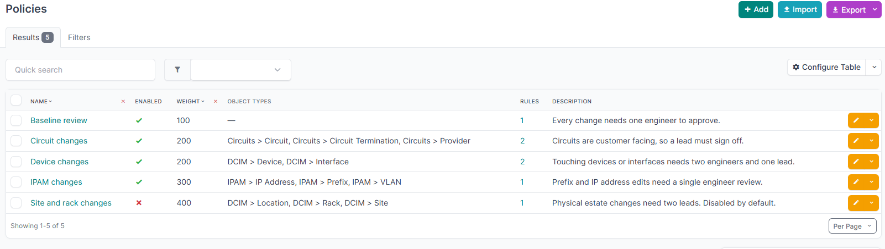
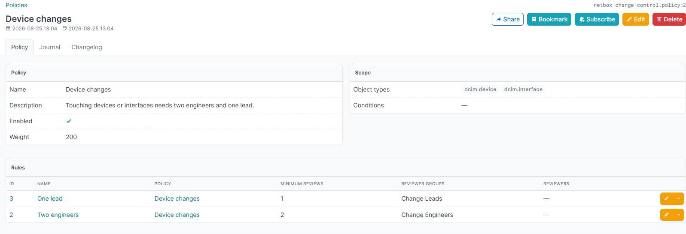
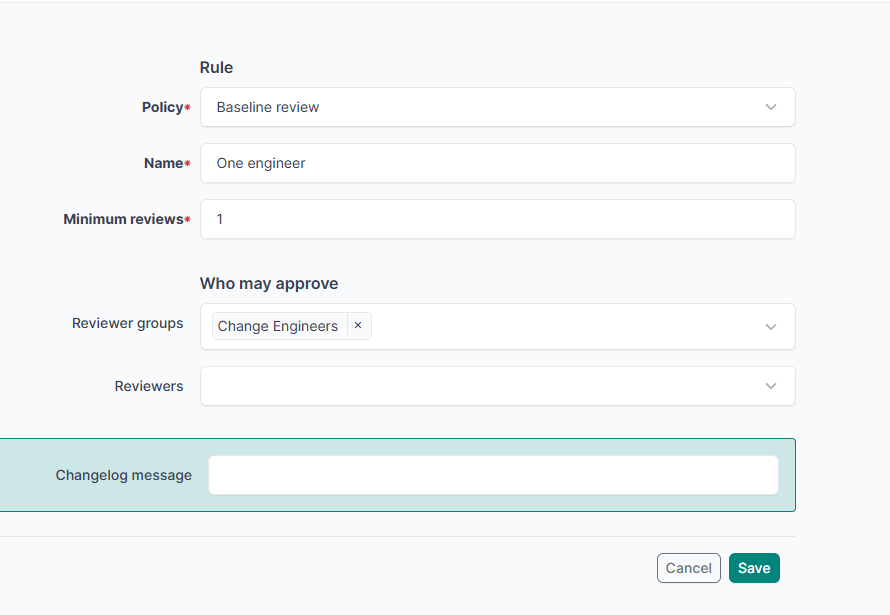

# Policies and rules



A **policy** is a named set of approval rules plus the scope that decides when those rules apply.



| Field | Meaning |
|---|---|
| Name | Identifies the policy. |
| Enabled | A disabled policy is never attached to a change request. |
| Weight | Evaluation order. Lower weights are listed first. |
| Object types | Apply when the branch touches any of these. Leave empty to apply to every branch. |
| Conditions | An optional NetBox condition set. See [narrowing a policy with conditions](policy-conditions.md). |
| Condition state | Which side of a change the conditions read. Defaults to either side. See [which side a condition reads](policy-conditions.md#which-side-a-condition-reads). |
| Checks | Pre-merge checks required only where this policy applies. See [checks which do not apply everywhere](checks.md#which-checks-apply-and-where). |

A **rule** is one approval requirement inside a policy.



| Field | Meaning |
|---|---|
| Minimum reviews | How many approvals this rule needs. Zero means none. |
| Reviewer groups | Members of any listed group may satisfy it. |
| Reviewers | Individually named users may satisfy it. |

A user is eligible if they are in **any** listed group **or** are named directly. A policy is satisfied when **every** one of its rules is satisfied.

The change request shows a rule the way you wrote it, naming its groups rather than listing everybody currently in them. A rule pointing at a group with no members is called out by name, because it can never be satisfied.

An approval counts only toward the rules the reviewer is eligible for. A lead approving does not advance a rule that requires engineers. This is the property a naive approval counter gets wrong.

> [!NOTE]
> A change request with no rules at all is never satisfied. An unpoliced merge is exactly what this plugin exists to prevent, so an empty rule set fails closed.

### Changes which need no human

Set **Minimum reviews** to `0`. The rule is satisfied the moment the change request exists, so it is approved without anybody acting, and the [pre-merge checks](checks.md) become the only gate.

That is the shape for scripted and low-risk work: nobody needs to read it, but it must still pass the same machine gate as everything else.

```
Policy   Automated IPAM
Scope    ipam.prefix, ipam.ipaddress
Checks   has-changes, no-conflicts, not-stale
Rule     "No approval required", minimum reviews 0
```

Tick **Merge automatically** on such a request and it merges itself as soon as the checks pass and the change window is open, with no human in the loop at any point.

Three things stay true, which is what makes this safe to offer:

- **A rejection still blocks.** Nobody has to look, but anybody who does can stop it.
- **The checks still gate.** A failing required check refuses the merge exactly as it would on a reviewed change.
- **It cannot weaken another policy.** Every rule of every attached policy must pass, so if the branch also matches a reviewed policy, that policy is still in force.

The last point is the one to plan around. A zero rule removes the human requirement **of its own policy only**. If your catch-all policy also matches the branch and asks for an engineer, the change still waits for that engineer. Scope the automatic policy so it is the only one matching, or narrow the catch-all with [conditions](policy-conditions.md).

The change request page shows the rule as **No approval required**, and the rule page carries an **Automatic** badge, so nobody has to wonder why a change was approved with no reviewers.

## Policies attach automatically

When a change request is opened, the plugin reads `ChangeDiff` for its branch, collects the object types actually touched, and attaches every matching enabled policy. Those bindings are locked against the author.

They also **follow the branch**. A branch is not fixed once its request is submitted: an author can keep editing inside it, and an edit can bring in an object type no attached policy covers. Whenever that happens the policies are matched again, so the new policy attaches and asks for whatever it asks for. The merge gate matches again for itself as well, so the decision never rests on a signal having fired.

That matters because the alternative is a way round the gate. Open a request on a branch touching only low-risk objects, collect the one approval that attracts, then add the real change to the same branch. The approvals go stale and the status returns to Needs review, but a policy that never attached asks for nothing, so the same reviewer could approve a second time and the work would merge unseen by anybody with the authority to judge it.

This is deliberately stricter than the commercial product, where the author picks the policies. Letting the author choose makes the gate advisory: someone who wants a fast merge picks the weakest policy.
