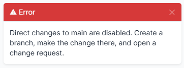

# Protecting main

`protect_main` blocks writes to branching-supported models made outside a branch. It is **off by default**, because turning it on by default would break an existing install the moment the plugin is added.



```python
'protect_main': True,
```

A refused write keeps the user on the form they were filling in, with the reason and what to do instead:

> Direct changes to main are disabled. Create a branch, make the change there, and open a change request.

A delete shows the same message as an error toast, and the REST API returns 400 with it as `detail`. The refusal is raised as NetBox's `AbortRequest`, which is the mechanism a signal receiver is given for exactly this. Raising `PermissionDenied` instead produced a bare **Access Denied** page with the explanation discarded, which reads like a misconfigured permission rather than a deliberate policy.

Users holding `netbox_change_control.bypass_policy` are exempt; see [granting the exemptions](permissions.md#granting-the-custom-actions). Writes with no request context, such as migrations, scripts and background jobs, are allowed: they are not interactive edits.

> [!NOTE]
> Superusers hold every permission, so a superuser is never blocked.

## Protecting only part of NetBox

The commercial product's equivalent is all-or-nothing. In practice a team often wants branch discipline on one risky area without forcing every IPAM edit through review.

`protect_main_scope` takes `app_label.modelname` or `app_label.*` entries:

```python
'protect_main': True,
'protect_main_scope': ['circuits.*'],
```

To protect specific models only:

```python
'protect_main_scope': ['circuits.provider', 'dcim.device'],
```

An entry naming one model does not protect its siblings in the same app. An empty list protects every branching-supported model.
