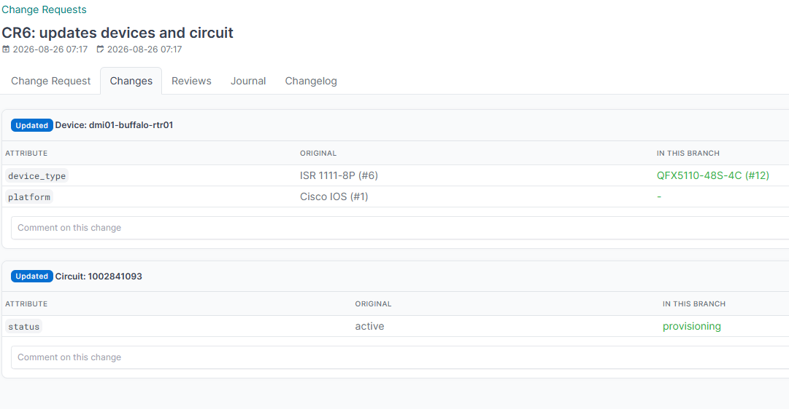

# Reviews

A review is one reviewer's position on the whole change request: **approve**, **request changes**, or **comment**.

The form appears in two places, so either works:

- on the change request page, in the Reviews card;
- on the change request's **Reviews** tab, under Submit a review.

If you see a note instead of the form, it tells you why: the request is closed, you opened it yourself, or your account lacks the review permission.

A reviewer holds at most one review per change request. Submitting again replaces the previous decision rather than adding a second one.

> [!NOTE]
> A user cannot review their own change request, and requesting changes requires a comment. Both are enforced on the model.

A review records which branch state it was made against. Submitting the form always refreshes that snapshot, because pressing submit restates your position. Editing a review any other way, such as correcting a typo through the object edit form or a bulk edit, deliberately does **not** refresh it. Otherwise an incidental edit would silently revalidate a stale approval against branch content the reviewer never saw. Changing the decision does refresh it, since that is a genuine restatement.

## Reviewing individual changes

The **Changes** tab lists every object the branch touches, with its changed attributes side by side: the original value and the value in this branch.

Related objects are shown by name, not by database id. A branch diff stores them as raw primary keys, so an unresolved row would read `provider 2 -> 3`, which tells a reviewer nothing. The tab renders that as `CenturyLink (#2) -> Comcast (#3)`, keeping the id for traceability. An object that no longer exists shows as `#7 (deleted)`. Lookups are batched per model, so a large diff costs one query per related model rather than one per value.

Each object carries its own comment thread, so a reviewer can raise a concern about one circuit rather than the whole request. Others reply in the thread, and a thread is resolved once it is dealt with. Replies are one level deep: a reply to a reply joins the same thread, which keeps a discussion readable.

The tab badge counts unresolved **threads**, not comments, so it always matches the banner on the page and the `threads-resolved` check. Resolution belongs to a thread: the flag is ignored on a reply, and resolving a thread closes it whatever its replies say.

The `threads-resolved` check can block the merge while any thread remains open.

## Editing a review

A reviewer may edit their own review, to correct a comment or change their decision. They cannot edit anybody else's; a superuser can.

The edit form exposes only the decision, the comment and tags. The reviewer and the change request are deliberately not editable, because a review is one person's statement about one change request and reassigning either would forge somebody else's position.

The REST API enforces the same thing from the other direction: `reviewer` is read-only and always the caller, so a token cannot post an approval attributed to somebody else. Naming another user is not an error; the review is simply recorded as yours.

Changing the decision through this form counts as a restatement, so it refreshes the branch snapshot the same way submitting the review form does. Editing only the comment does not.

## Markdown in comments

Every free-text field people write into supports Markdown, rendered with NetBox's own filter:

| Field | Where |
|---|---|
| Review comment | The review form on the change request and its Reviews tab |
| Change comment and replies | The Changes tab |
| Description and comments | The change request and policy forms |
